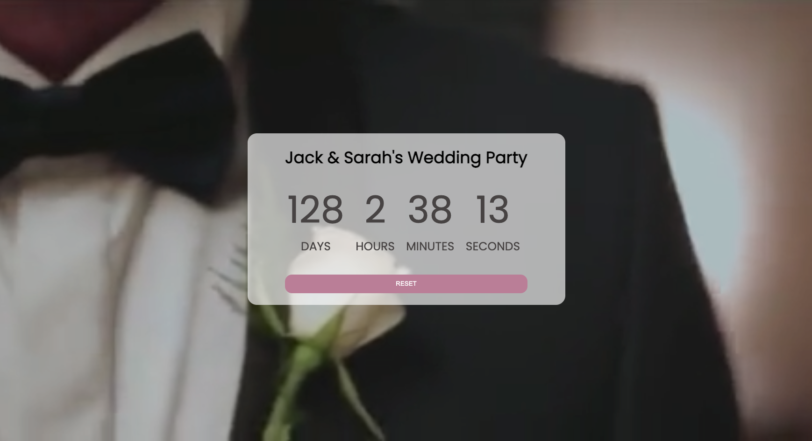
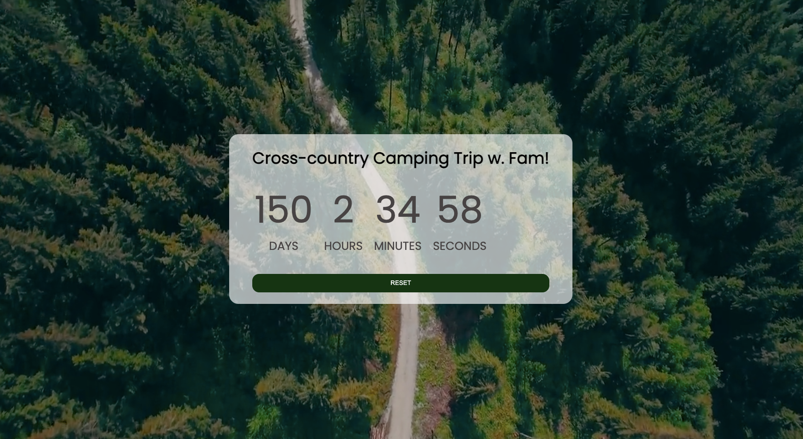

# Countdown Timer
Check out the <a href="https://annakim.dev/Countdown" target="_blank">Live demo here</a> 🎬

A responsive and mobile-friendly custom countdown timer with a video background. 
Users can create a title of the event and select the date. localStorage allows users to come back to the site later and see the remaining time without having to re-enter the data.

## Screenshot 📷
 </img>
 </img>
 
 ## Tech Stack
 * Vanilla Javascript
 * Custom CSS | HTML
 
 ## Set Up
 * Clone this repo into your local computer using the ssh key
 * CD into the repo 'Countdown'
 * run the following CLI command 'open index.html'
 
